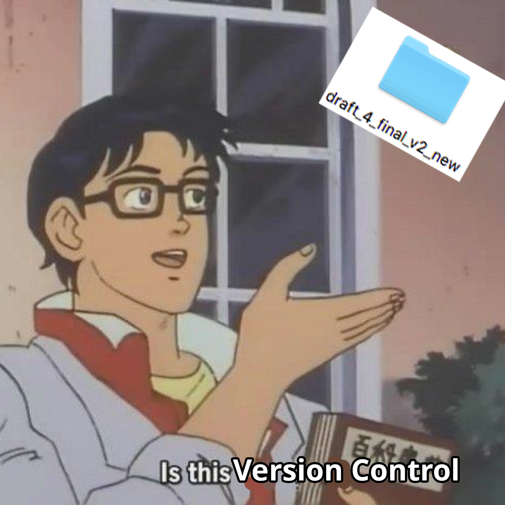
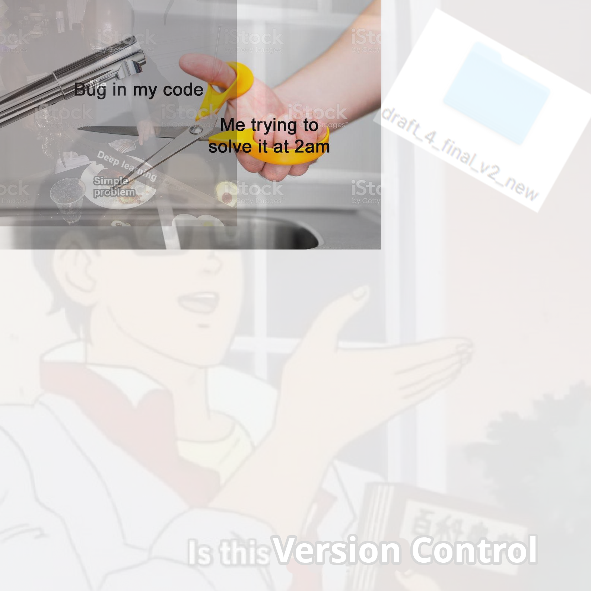

.. _tutorial:

Tutorial
========

``kneejerk`` is a library that accomplishes scoring/using your image data in two steps:

1. Rapid scoring of your images via the Command Line Interface (CLI)
2. Using the file generated by (1) to load all of your images into a ``numpy.array``.

Let's go through these now.

Example Project
----------------

Suppose you've got a simple directory called ``scratch`` that contains the following images, tucked away in a subdirectory called ``images``

.. image:: _static/bug_fixing.jpg
    :width: 400px

.. image:: _static/deep_learning.jpg
    :width: 400px

At this point our project structure looks like

.. code:: none
    
    scratch
     |
     |--- images
            |
            |--- bug_fixing.jpg
            |--- deep_learning.jpg
            |---- version_control.png

Scoring
----------

Now we want to actually score our data.

To do this, we'll leverage the ``kneejerk`` CLI that you got for free as a result of ``pip`` installing the library.

Doing this is as simple as typing ``kneejerk score`` and then populating the following options:

- ``-i``, the location of the directory containing your images, defaulted to wherever you called ``kneejerk`` from
- ``-f``, the name of the resulting ``.csv``, defaulted to ``output.csv``
- ``-o``, the directory to dump the ``.csv`` from the last step. Also defaulted to wherever you called the tool
- ``-s``, shuffles the order that images are served up, defaulted to ``True``
- ``--min``, the minimum accepted value you input when scoring, defaulted to ``0``
- ``--max``, the maximum accepted value you input when scoring, defaulted to ``1``

On Our Data
~~~~~~~~~~~~

So in our case, if we wanted to launch the tool from the root diectory of ``scratch``, aimed at our images, and dropping a resulting ``.csv`` at the root of the project, we'd use the following:

.. code:: none
    
    $ kneejerk score -i images -o . -f example.csv -s True

Which will immediately launch a ``matplotlib`` interface that waits for your keyed value for the image.

.. image:: _static/cli_1.PNG
    :width: 600

Pressing your value will immediately log your score, close the current image, and open the next. This repeats until you've gone through the whole input directory.

When this is finished, your project structure will now look like

.. code:: none
    
    scratch
     |
     |--- images
            |
            |--- bug_fixing.jpg
            |--- deep_learning.jpg
            |---- version_control.png
     |--- example.csv

Inspecting, we'll see that the output file is of the form ``(filepath, score)``, like so (omitting my full firepath):

.. code:: none

    $ cat example.csv
    scratch\images\bug_fixing.jpg,1
    scratch\images\deep_learning.jpg,1
    scratch\images\version_control.png,0

Loading
-------

In order to make our image data useful for any Machine Learning routine we want to build, we'll need to convert our images to numeric, matrix representations. The ``kneejerk.data.loader`` module handles this neatly.

Generic Data Loading File
~~~~~~~~~~~~~~~~~~~~~~~~~

The following file, ``foo.py``, saved and executed from the root directory of your project is all you need to get all of your data loading out of the way and let you get to the fun stuff. Everything after line 3 is merely included for this tutorial.

.. code:: python
    :linenos:

    from kneejerk.data.loader import transfer_normalized_image_data

    X, y = transfer_normalized_image_data('example.csv')

    print('Shape of image matrix:', X.shape)
    print('Shape of score matrix:', y.shape)

    print('RGB values of the top-left 5x5 of the first image')
    print(X[0, :5, :5])

Running this yields

.. code:: none

    $ python foo.py
    Max height: 1587
    Max width : 1587
    Shape of image matrix: (3, 200, 200, 3)
    Shape of score matrix: (3,)
    RGB values of the top-left 5x5 of the first image
    [[[215 215 215]
      [210 210 210]
      [207 207 207]
      [207 207 207]
      [209 209 209]]

     [[217 217 217]
      [212 212 212]
      [209 209 209]
      [207 207 207]
      [209 209 209]]

     [[219 219 219]
      [213 213 213]
      [210 210 210]
      [207 207 207]
      [209 209 209]]

     [[219 219 219]
      [213 213 213]
      [210 210 210]
      [208 208 208]
      [208 208 208]]

     [[221 221 221]
      [215 215 215]
      [211 211 211]
      [210 210 210]
      [210 210 210]]]

On Image Dimensions
~~~~~~~~~~~~~~~~~~~

Most of the Machine Learning applications built with image data in mind expect a consistent, often square, image resolution on all of the observations you pipe in.

This means that one must consider:

- Oblong, non-square images
- Images of different sizes

For purposes of this tutorial, we picked three images that were deliberately rectangular and of mismatched sizes.

Resolving Rectangles
~~~~~~~~~~~~~~~~~~~~

Before we do any image rescaling, we first ensure that all of our data is a square. We do this by padding our images with ``(R, G, B) = (0, 0, 0)`` black, anchoring the image in the top-left. I like how paint.net illustrates this.

This will give an image like the following

.. image:: _static/bug_fixing_square.jpg
    :width: 600

Resolving Image Sizes
~~~~~~~~~~~~~~~~~~~~~

We coded up two approaches for handing differences in image resolutions, flexible to your use case. Both of which correspond to the ``consider_size`` argument located in ``kneejerk.data.loader.transfer_normalized_image_data``.

Setting ``consider_size=False``, the default
#############################################

If you want the size/resolution of your input images to have no bearing on the results of your algorithm/analysis, use this argument.

After padding each image to a square, it will either up or downscale each image to the same uniform size. (See :ref:`rescaling` for more on this.)

Your resulting images will look like this, layered for comparison.

.. image:: _static/_stacked_downscaled.png
    :width: 600

Setting ``consider_size=True``
###############################

Alternatively, maybe the size of your image *is* of some importance. Setting this argument to ``True`` will parse through your input directory to find the largest height/width dimension, and then pad every single image with black until it achieves that resolution.

Again, we'll layer the resulting images for comparison.

.. image:: _static/_stacked_expanded.png
    :width: 600

.. _rescaling:

Rescaling Images
~~~~~~~~~~~~~~~~

Finally, regardless of which image-size-mismatch scheme you elect to use, the final step the ``loader`` handles for you is rescaling each image to some predetermined ``n X n`` size, where the default is ``200``.

This is commonplace, especially for large datasets, to lower the memory strain needed to run through your algorithms.
